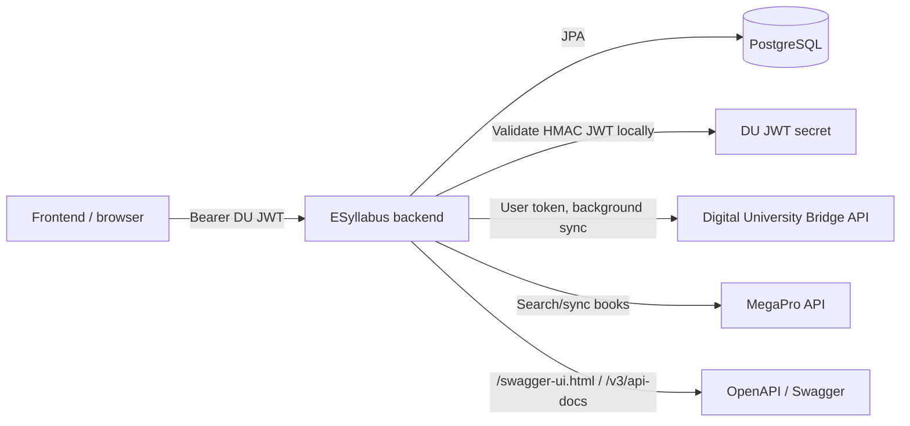
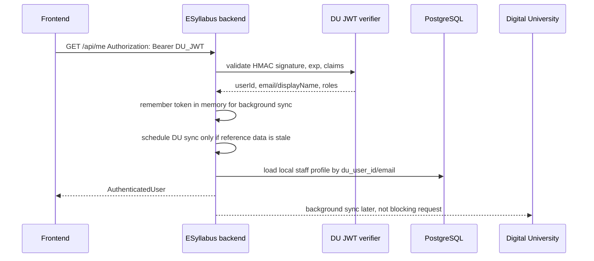
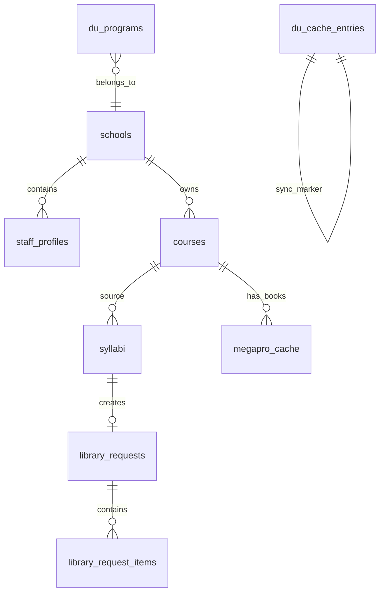
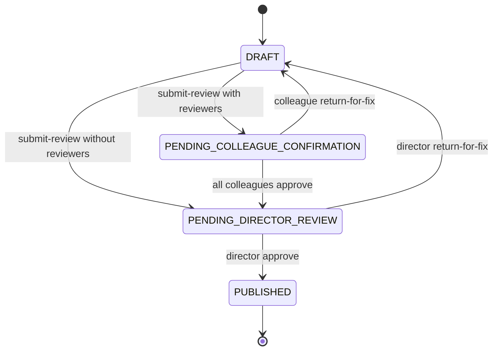

# Архитектура проекта ESyllabus

## 1. Назначение системы

ESyllabus - backend-сервис для цифрового процесса подготовки и согласования силлабусов в университете. Сервис хранит локальное рабочее состояние силлабусов, заявок в библиотеку и кэшированных справочников, а мастер-данные по сотрудникам, школам, образовательным программам и дисциплинам получает из Digital University.

Ключевые функции:

- авторизация через Digital University Bearer JWT;
- создание и редактирование силлабусов преподавателем;
- назначение коллег-рецензентов и директора школы;
- подтверждение силлабуса коллегами;
- финальное подтверждение директором школы;
- публикация силлабуса после подтверждения директором;
- автоматическое создание библиотечной заявки после публикации силлабуса;
- ручное создание и обработка библиотечных заявок;
- поиск книг и тегов из MegaPro cache;
- PDF export силлабуса;
- XLSX export библиотечных заявок.

## 2. Технологический стек

| Компонент | Технология |
| --- | --- |
| Runtime | Java 21 |
| Framework | Spring Boot 4.0.3 |
| Web | Spring WebMVC |
| Security | Spring Security, stateless Bearer JWT |
| Persistence | Spring Data JPA, Hibernate |
| Database | PostgreSQL в Docker/production, H2 для локального fallback/test |
| API docs | springdoc-openapi, Swagger UI |
| PDF export | openhtmltopdf + pdfbox |
| XLSX export | Apache POI |
| Build | Maven Wrapper |
| Containerization | Dockerfile, docker-compose.yml, docker-compose.prod.yml |

## 3. Высокоуровневая схема

## 4. Backend layers

| Layer/package | Ответственность |
| --- | --- |
| `web` | REST controllers, HTTP endpoints, API exception handling. |
| `security` | DU JWT validation, current user resolution, role normalization. |
| `directory` | Локальные справочники школ, сотрудников, программные options для UI. |
| `syllabus` | Курсы, силлабусы, workflow согласования, PDF export. |
| `requests` | Библиотечные заявки, approval workflow, feedback, XLSX export. |
| `integration.digital` | Digital University bridge, background sync, user-token registry. |
| `integration.megapro` | MegaPro client, sync scheduler, book/resource cache. |
| `config` | OpenAPI, JSON mapper, request logging, DB check-constraint sync. |

## 5. Security architecture

Система stateless. Basic Auth и Form Login отключены. Все защищенные endpoint-ы требуют `Authorization: Bearer <DU_JWT>`.

Публичные endpoint-ы:

- `/`;
- `/error`;
- `/api/public/**`;
- `/swagger-ui.html`;
- `/swagger-ui/**`;
- `/v3/api-docs/**`.

Основной поток авторизации:

Важное решение: отдельного `DU_SERVICE_TOKEN` нет. Для синхронизации используется последний валидный пользовательский DU JWT, полученный от frontend. Если startup/cron не имеет валидного токена, sync становится pending и запускается после следующего валидного пользовательского запроса.

## 6. Роли

| Внутренняя роль | Источник | Использование |
| --- | --- | --- |
| `TEACHER` | DU role claims или позиция сотрудника | Создание и редактирование силлабуса, участие как коллега-рецензент. |
| `DIRECTOR` | DU role claims или `SCHOOL_DIRECTOR` staff role | Финальное подтверждение силлабусов и библиотечных заявок своей школы. |
| `LIBRARIAN` | DU role claims или позиция сотрудника | Просмотр утвержденных заявок, feedback по закупке, XLSX export. |

Локальная роль `SCHOOL_DIRECTOR` хранится в `staff_profiles.role`, но наружу для текущего пользователя директор нормализуется как `DIRECTOR`.

## 7. Доменная модель

## 8. Основные таблицы

| Таблица | Назначение |
| --- | --- |
| `schools` | Школы университета и username директора школы. |
| `staff_profiles` | Сотрудники, роли, школа, рабочее место, кабинет, DU identifiers и raw DU profile. |
| `courses` | Дисциплины/курсы из DU teacher disciplines. |
| `syllabi` | Силлабусы, JSON content, статус согласования, reviewers, director, linked library request. |
| `library_requests` | Заявки на библиотечные ресурсы. |
| `library_request_items` | Позиции заявок: книги, дисциплины, программа, курс, количество. |
| `du_programs` | Образовательные программы из DU. |
| `du_cache_entries` | Marker последней успешной синхронизации DU reference data. |
| `megapro_cache` | Локальный кэш книг MegaPro, привязанный к дисциплинам/курсам. |

## 9. Статусы силлабуса

| Статус | Значение |
| --- | --- |
| `DRAFT` | Черновик, доступен для редактирования владельцем. |
| `PENDING_COLLEAGUE_CONFIRMATION` | Ожидает подтверждения назначенными коллегами. |
| `PENDING_DIRECTOR_REVIEW` | Все коллеги подтвердили или коллеги не выбраны; ожидает директора. |
| `NEEDS_REVIEW` | Legacy/compat статус, трактуется как pending director review. |
| `PUBLISHED` | Финально подтвержден директором и опубликован. |

Workflow:

## 10. Статусы библиотечной заявки

| Статус | Значение |
| --- | --- |
| `DRAFT` | Черновик заявки. |
| `PENDING_DIRECTOR_APPROVAL` | Ожидает подтверждения директора школы. |
| `APPROVED_BY_DIRECTOR` | Подтверждена директором, доступна библиотекарю. |
| `REJECTED_BY_DIRECTOR` | Отклонена директором с комментарием. |
| `FEEDBACK_PROVIDED` | Библиотекарь оставил feedback и, при наличии, ожидаемый месяц закупки. |

## 11. Интеграции и хранение данных

| Источник | Что берем | Где храним |
| --- | --- | --- |
| Digital University `/api/v1/user/employees` | Сотрудники, employeeId, userId, ФИО, email, школа/подразделение, позиция, статус | `staff_profiles` |
| Digital University `/api/v1/schools` | Школы | `schools` |
| Digital University `/api/v1/education_programs` | Образовательные программы | `du_programs` |
| Digital University `/api/v1/teacher_disciplines` | Дисциплины академической нагрузки | `courses` |
| MegaPro search API | Книги по дисциплинам и тегам | `megapro_cache` |

## 12. Нефункциональные решения

| Решение | Комментарий |
| --- | --- |
| Stateless auth | Backend не хранит HTTP-сессии. |
| User-token sync | DU sync использует только валидный пользовательский JWT; service token не требуется. |
| Background DU sync | Долгие DU HTTP-вызовы не блокируют `/api/me` и обычные API. |
| Request logging | Все HTTP-запросы логируются через `HttpRequestLoggingFilter`: method, path, status, duration, user, IP, user-agent, referer. |
| Hibernate `ddl-auto=update` | Схема БД обновляется Hibernate. Для строгого production change management рекомендуется добавить миграции Flyway/Liquibase в будущем. |
| OpenAPI | Swagger UI включен по умолчанию. В production можно выключить через `springdoc.*.enabled=false`, если требуется политика безопасности. |

## 13. Ограничения текущей реализации

- Локального реестра студентов и отдельной таблицы студентов нет.
- Отдельного service account для DU нет, поэтому первая синхронизация после рестарта ждет валидный пользовательский DU JWT.
- Секреты и реальные внешние URL не должны быть закоммичены в репозиторий.
- Скриншоты UI не включены в backend repository; их нужно приложить отдельно из frontend/test environment, если акт передачи требует визуальные материалы.

