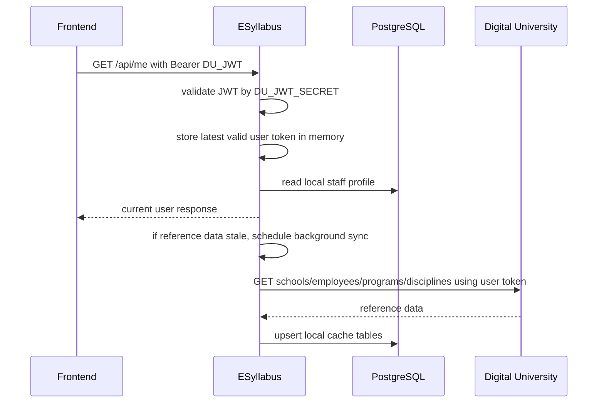
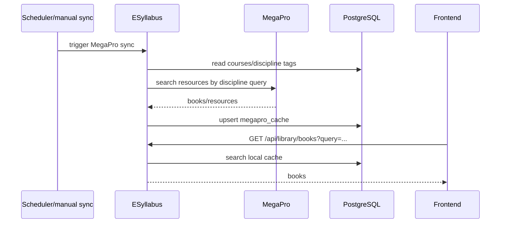

# Integration guide

## 1. Digital University integration

### 1.1. Назначение

Digital University является источником:

- пользовательского JWT для входа в ESyllabus;
- сотрудников и ролей;
- школ;
- образовательных программ;
- дисциплин академической нагрузки.

Backend не использует Basic Auth и не имеет отдельного DU service token. Все защищенные запросы frontend отправляет с пользовательским DU JWT.

### 1.2. Настройки

| Variable | Назначение | Пример |
| --- | --- | --- |
| `DU_ENABLED` | Включить DU-интеграцию. | `true` |
| `DU_BASE_URL` | Base URL DU bridge. | `https://bridge-du.astanait.edu.kz` |
| `DU_JWT_ENABLED` | Включить JWT validation. | `true` |
| `DU_JWT_SECRET` | HMAC secret для проверки DU JWT. | Передается секретно |
| `DU_CACHE_ENABLED` | Включить sync справочников. | `true` |
| `DU_CACHE_REFRESH_INTERVAL` | TTL локального marker sync. | `12h` |
| `DU_CACHE_REFRESH_CRON` | Расписание sync. | `0 0 */12 * * *` |
| `DU_CACHE_PAGE_SIZE` | Размер страницы для paginated DU endpoints. | `100` |
| `DU_CACHE_MAX_PAGES` | Защита от бесконечной пагинации. | `50` |

`DU_SERVICE_TOKEN` не используется и не должен задаваться в CI/CD variables.

### 1.3. DU endpoints, которые использует backend

| DU endpoint | Назначение | Локальная таблица |
| --- | --- | --- |
| `GET /api/v1/user/employees` | Список сотрудников, paginated. | `staff_profiles` |
| `GET /api/v1/employees/{employeeId}` | Детальный профиль сотрудника, если нужен точечный lookup. | `staff_profiles.du_raw_json` |
| `GET /api/v1/schools` | Школы. | `schools` |
| `GET /api/v1/education_programs` | Образовательные программы. | `du_programs` |
| `GET /api/v1/teacher_disciplines` | Дисциплины академической нагрузки. | `courses` |

### 1.4. Auth and sync sequence



### 1.5. Если cron сработал без токена

1. Backend проверяет, есть ли валидный пользовательский токен в memory.
2. Если токена нет, sync помечается как pending.
3. Следующий валидный пользовательский запрос с DU JWT регистрирует токен.
4. Backend запускает pending sync в background.

Это предотвращает ошибки из-за отсутствия service token и не блокирует пользовательские запросы.

### 1.6. Пример проверки текущего пользователя

```bash
TOKEN="<DU_JWT_FROM_FRONTEND>"
BASE_URL="http://localhost:8084"

curl -H "Authorization: Bearer $TOKEN" "$BASE_URL/api/me"
```

Expected response shape:

```json
{
  "email": "user@astanait.edu.kz",
  "displayName": "User Name",
  "roles": ["TEACHER"],
  "employeeId": 123,
  "userId": 456,
  "username": "user@astanait.edu.kz",
  "schoolId": "1",
  "schoolName": "School of ...",
  "positionTitle": "Senior Lecturer",
  "status": "Working",
  "duSyncedAt": "2026-06-29T08:00:00Z",
  "duProfile": {}
}
```

## 2. MegaPro integration

### 2.1. Назначение

MegaPro используется как источник книг/ресурсов для дисциплин. Backend синхронизирует или ищет книги, сохраняет локальный cache в `megapro_cache`, после чего frontend работает с быстрыми ESyllabus API.

### 2.2. Настройки

| Variable/property | Назначение |
| --- | --- |
| `megapro.enabled` / `MEGAPRO_ENABLED` | Включить MegaPro client. |
| `megapro.base-url` / `MEGAPRO_BASE_URL` | Base URL MegaPro API. |
| `megapro.search-path` | Path поиска книг. |
| `megapro.auth-header-name` | Имя header для API key, если нужен. |
| `megapro.auth-header-value` | Значение API key, если нужен. |
| `megapro.sync-enabled` | Включить scheduler sync. |
| `megapro.sync-cron` | Расписание sync. |
| `megapro.sync-limit-per-course` | Лимит книг на курс при sync. |

В текущем `application.properties` MegaPro по умолчанию выключен: `megapro.enabled=false`.

### 2.3. Backend endpoints для frontend

| Endpoint | Назначение |
| --- | --- |
| `GET /api/library/books?query=<text>&limit=20` | Поиск книг в локальном MegaPro cache. |
| `GET /api/library/book-tags?search=<text>` | Список тегов книг. |
| `GET /api/library/disciplines?search=<text>` | Дисциплины с количеством синхронизированных книг. |
| `POST /api/library/megapro/sync` | Ручной запуск sync пользователем с правами. |

### 2.4. Sequence



## 3. Справочные screenshots для передачи

Рекомендуемые скриншоты для Confluence/акта:

| Screenshot | Где сделать | Что показать |
| --- | --- | --- |
| Swagger UI | `/swagger-ui.html` | Список API groups и Bearer auth scheme. |
| `/api/me` response | Swagger/Postman/browser devtools | Профиль пользователя после DU auth. |
| Список курсов | Frontend page или `GET /api/courses` | Дисциплины из DU sync. |
| Builder силлабуса | Frontend | Заполнение и progress секций. |
| Review queue | Frontend | Очередь коллеги/директора. |
| Библиотечная заявка | Frontend | Заявка после approval директора. |
| Library feedback | Frontend | Feedback библиотекаря и expected purchase month. |

## 4. Диагностика интеграций

| Симптом | Вероятная причина | Что проверить |
| --- | --- | --- |
| `401 Unauthorized` | JWT отсутствует, истек или подписан другим secret. | `Authorization` header, `DU_JWT_SECRET`, время сервера. |
| `/api/me` возвращает fallback без school | Пользователь еще не синхронизирован из DU. | Дождаться background sync, проверить логи DU sync. |
| DU sync не стартует после рестарта | Еще не было валидного пользовательского токена. | Выполнить любой защищенный запрос с DU JWT. |
| `429 Too Many Requests` от DU | Частые запросы к DU. | Проверить cooldown и cron; обычные API не должны напрямую дергать DU. |
| Пустой список книг | MegaPro выключен или cache пустой. | `megapro.enabled`, `POST /api/library/megapro/sync`, таблица `megapro_cache`. |

